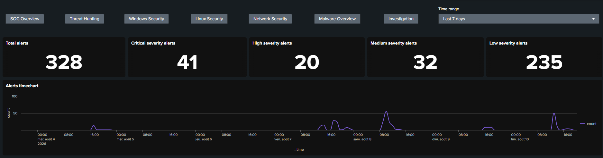
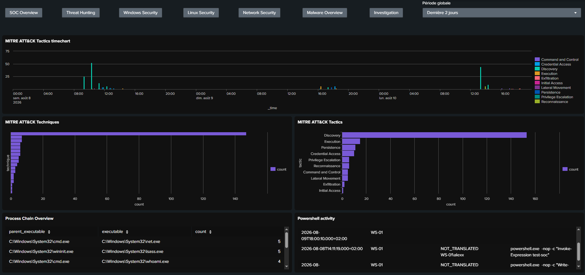
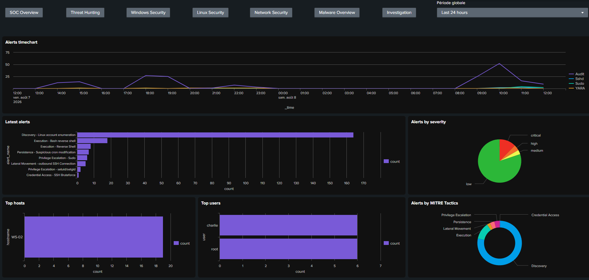
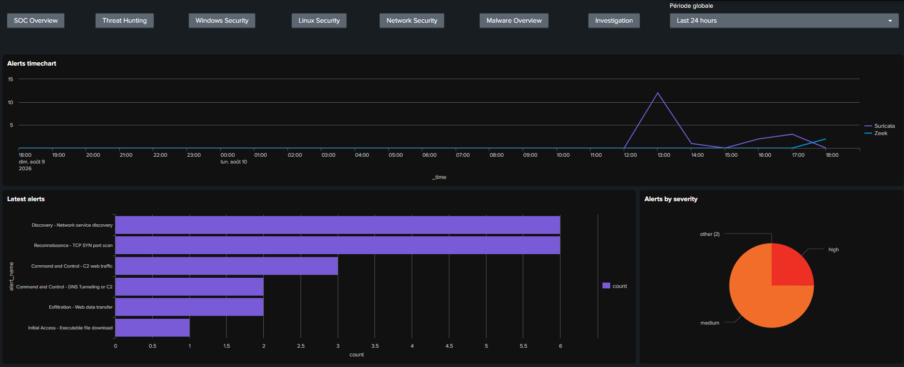
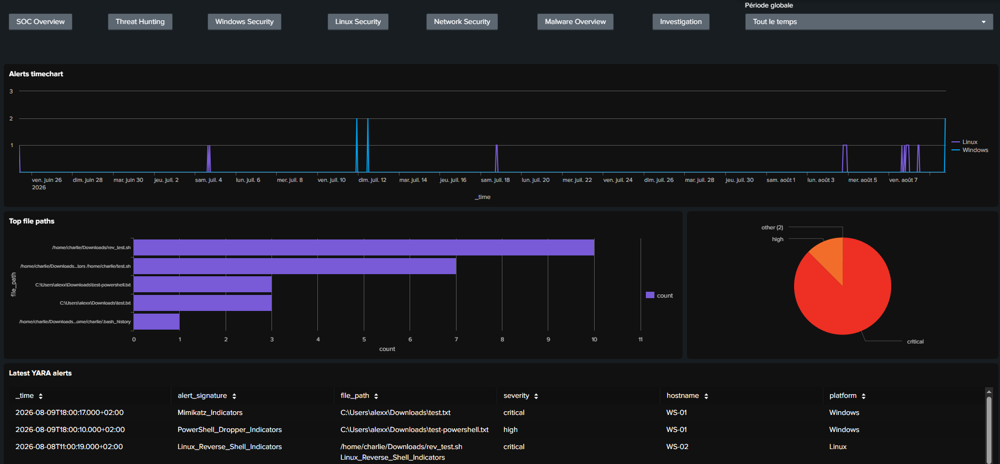
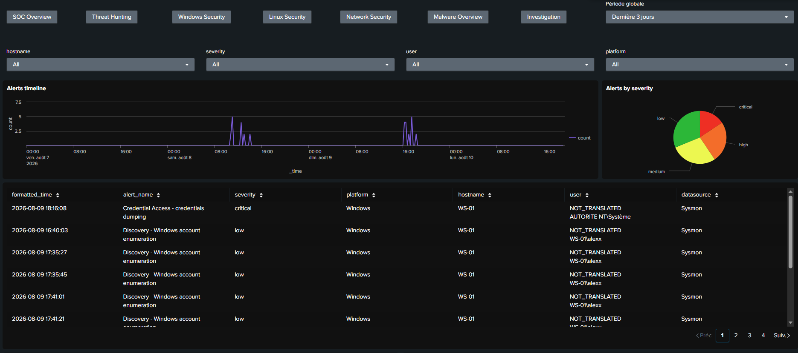

## Dashboards

All dashboards are based on the alerts stored in the `siem_alerts` index, collected through the reports presented in the previous section [04-splunk-alerts](../04-splunk-alerts/).

All dashboard include a navigation bar at the top to make it easier to switch from one dashboard to another. The time range can be selected independently for each dashboard, the default value is set to last 24 hours.

The complete set of dashboard screenshots is available in the
[`screenshots/`](screenshots/) directory.

### Overview Dashboard

The Overview dashboard shows the main KPIs and global information such as total number of alerts, alerts by severity and platform, a global timechart, and the latest alerts.

### Threat Hunting Dashboard

The Threat Hunting dashboard shows the main MITRE ATT&CK tactics and techniques associated with the alerts. To achieve this, the logs are enriched using a lookup in Splunk. The [lookup.csv](./lookup.csv) file contains the mapping for the MITRE ATT&CK Tactics and Techniques of interest for the lab.

Here is an example of how the lookup is used in Splunk requests for the dashboard : `| lookup mitre_lookup mitre_id AS mitre_technique OUTPUT tactic`.

### Windows Security Dashboard

The Windows Security dashboard shows exclusively information about Windows endpoints. This includes timechart, latest alerts, top event codes, top hosts, top users, alerts by severity, latest command lines.

### Linux Security Dashboard

The Linux Security dashboard shows exclusively information about Linux endpoints. This includes timechart, latest alerts, top hosts, top users, alerts by severity, latest bash commands.

### Network Security Dashboard

The Network Security dashboard shows the information about alerts concerning network activity. This includes alerts timechart, by severity, latest alerts, and top source and destination IP addresses and ports.

### Malware Overview Dashboard

The malware overview dashboard shows information based on all YARA alerts, accross the endpoints. This includes path of the suspicious file, name of the YARA alert. This dashboard could be improved in the future by including the hash of the concerned files to facilitate the investigation.

### Investigation Dashboard

This dashboard aims to facilitate the initial investigation, by allowing the analyst to filter results by hostname, user, severity and platform.

