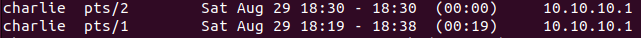
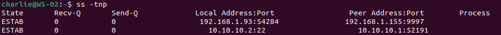

# Incident Response

## Live detection

Detect live sessions, associated PIDs, source IP address:
```
who                          
w                            
last -a | head -30            
ss -tnp | grep ':22'         
```

The results show an ongoing SSH session originating from 10.10.10.1.




Detect live network connections:
```
ss -tnp                       
lsof -i -P -n                
ps auxf                      
```



Find persistence method established for any user:
```
for u in $(cut -f1 -d: /etc/passwd); do
  echo "== $u =="; cat /home/$u/.ssh/authorized_keys 2>/dev/null
done
systemctl list-unit-files --state=enabled | grep -vE '^(systemd|cron|ssh|network)'
find /etc/systemd/system -maxdepth 1 -newer /etc/hostname -type f
crontab -l -u charlie 2>/dev/null
cat /etc/crontab; ls -la /etc/cron.d/
find / -perm -4000 -type f 2>/dev/null   
```

Verify the shell history:
```
echo $HISTFILE
stat ~/.bash_history
```

## Contain

Stop the attacker session:
```
kill -9 4365
loginctl terminate-user charlie
```


Neutralize the compromised account
```
usermod -L charlie                    
usermod -s /usr/sbin/nologin charlie  
```

Block any outbount or inbound network connection involving the attacker IP address:
```
iptables -A OUTPUT -d 10.10.10.1 -j DROP
iptables -A INPUT -s 10.10.10.1 -j DROP
```


## Eradicate

Identify and remove the added SSH key:
```
cat ~/.ssh/authorized_keys
sed -i '/6DY7Q64Lh8oQZIitIn/d' ~/.ssh/authorized_keys
```

Remove all cron related activity:
```
crontab -e -u charlie
ls -la /etc/cron.d/ 
cat /etc/crontab
sed -i '/work_task.sh/d' /etc/crontab
```

Once the evidence is preserved, delete the malicious file used to achieve persistence:
```
rm /home/charlie/work_task.sh
```

Remove the folder used for data collection
```
rm -rf /home/charlie/docs
```

Rotate all exfiltrated secrets:
```
passwd charlie          
```

Remove the SUID bit from the binary:
```
chmod -s /usr/bin/find
```

## Recover & Validate

Verify no persistence method is left:
```
for u in $(cut -f1 -d: /etc/passwd); do cat /home/$u/.ssh/authorized_keys 2>/dev/null; done
systemctl list-unit-files --state=enabled | grep -i backdoor   
find / -perm -4000 -type f 2>/dev/null   
who; w                                    
```

Unlock the user:
```
sudo usermod -U charlie
```

