# Investigation

## 1.0. Reconnaissance

### 1.1. Detection 

Network recon related alerts are detected based on Suricata detection rules. They trigger when large SYN TCP traffic is detected in a short amount of time. Both alerts SPL-01 and SPL-19 are based on the same Suricata detection rule.

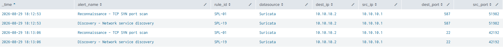

_Figure-01: Reconnaissance alerts_

### 1.2. Host Discovery 

We pivot to Zeek connection logs using the source IP address (10.10.10.1) and the timestamp (18:12:53) observed in the alerts as pivot fields. The SPL request is as follows:
```
index="monitoring" sourcetype="*zeek*" src_ip="10.10.10.1" dest_ip="*"
| stats count by dest_ip
```
zeek logs show the following connection around the time of the alerts:
| dest_ip | count
| - | -
| 10.10.10.2 | 747
| 10.10.10.4 |	1


Packet-level telemetry is reviewed to validate the network activity associated with the alerts.

The packet capture shows ARP requests originating from 10.10.10.1 and targeting the 10.10.10.0/24 subnet. Only two hosts respond to the ARP requests in the captured traffic (10.10.10.2 and 10.10.10.4). The two TCP SYN packets followed by RST/ACK responses correspond to the active hosts identified during discovery and explain the traffic that triggered the first Suricata SYN-scan alert at 18:12. The host discovery scan itself was not detected.

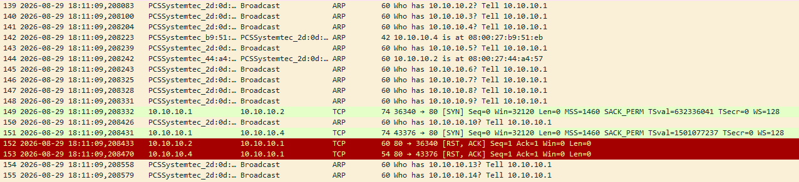

_Figure-02: Packet-level evidence of network host discovery_

### 1.3. Port Discovery

Following the host discovery, the packet capture shows TCP SYN requests originating from 10.10.10.1 and targeting 10.10.10.2 on a wide range of port numbers. This can be associated with a port scan targeting the 10.10.10.2 host. A few ports responded with the SYN/ACK flags and are probably opened (21, 22, 139, 445), indicating that these ports were reachable, had a service listening at the time of the scan and could be investigated by an attacker. Common services associated with this ports are respectively FTP, SSH, SMB-related services.
Wireshark request to find open ports responding to the port scan:
`ip.src == 10.10.10.2 && tcp.flags.syn == 1 && tcp.flags.ack == 1`

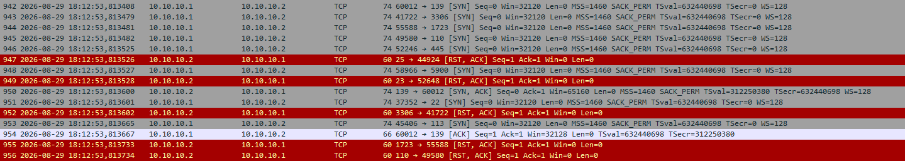

_Figure-03: Packet-level evidence of service discovery on the targeted host_

### 1.4. Service Interaction

The packet capture also shows an FTP connection immediately after the Service discovery scan ends. The connection is initiated from 10.10.10.1, and does not lead to a successful FTP session to the ftp server. However the banner `Welcome to charlie's FTP service.` is returned to the client that initiated the connection. This connection is not detected in the SIEM.

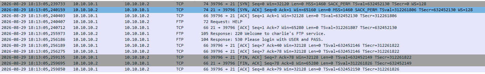

_Figure-04: Packet-level evidence of an FTP connection on the targeted host_


### 1.5. Conclusion

Both SPL-01 and SPL-19 are confirmed as true positives. Packet-level and Zeek telemetry show reconnaissance activity originating from 10.10.10.1 against 10.10.10.2, including host discovery followed by a TCP SYN port scan. The scan identified several exposed services, including FTP, SSH, and SMB. The packet capture also shows a subsequent FTP connection that did not result in a successful session. 


## 2.0. Initial access

### 2.1. Detection

SSH related alerts are detected based on sshd logs. The SPL-16 alert is triggered when a large number of failed connection attempt concerning the same user. The SPL-21 alert is triggered when an SSH connection is successfully established.

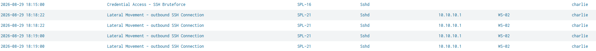

_Figure-05: SSH related Alerts_

### 2.2. SSH Bruteforce

We pivot to sshd logs using the pivot fields user (charlie) and the timestamp (18:15:00) to define the investigation window. The sshd logs show a high volume of failed connection around the alert timestamp.

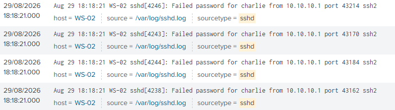

_Figure-06: Failed SSH logins_


This SPL request is executed to get indicators about the brute force attempt:
```
index="linux_os" sourcetype="sshd" user=charlie
| stats 
    count(eval(match(_raw,"Failed password|authentication failure"))) as failures
    min(_time) as first_attempt
    max(_time) as last_attempt
  by src_ip
| convert ctime(first_attempt) ctime(last_attempt)
```

The result shows requests originating from a single IP address (10.10.10.1).
| src_ip |	failures |	first_attempt |	last_attempt
| - | - | - | -
| 10.10.10.1 |	208 |	08/29/2026 18:17:25 |	08/29/2026 18:18:22

### 2.3. Successful SSH connection

Sshd logs show that 2 successful SSH connection are established for the user charlie, originating from the src_ip 10.10.10.1, respectively at 18:18:22.000 and 18:19:00.000 when looking for the keywords "Accepted password". 

However, the pam events show 3 successive ssh sessions concerning the targeted account.

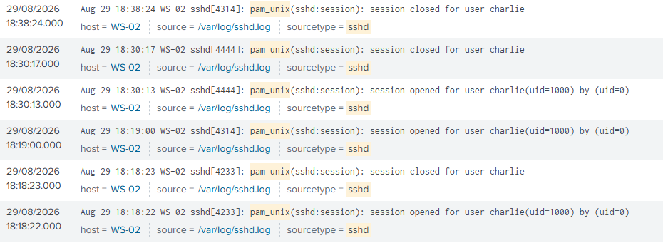

_Figure-07: SSH sessions_

The first session was opened and closed almost immediately after the successful authentication. It can be correlated with the brute-force tool validating the discovered credentials, as its timestamp immediately follows the last observed failed authentication attempt. (18:18:22).

The second session was opened shortly after and closed almost 30 minutes later, using the compromised account. This indicates that an SSH session was established using the compromised account. The start time of this session matches the timestamp of the first SSH connection alert (18:19:00).

A third session was established before the second session was closed, also using the compromised account. However, this session timeline does not match with any SSH alerts. The reason why this session was not detected will be investigated as the timeline progresses.

### 2.4. Conclusion

Both SPL-16 and SPL-21 are confirmed as true positives. A bruteforce attack is observed, originating from the source IP address 10.10.10.1, and targeting the user account charlie, with 208 failed connection attempts within 57 seconds. A subsequent successful authentication was observed, indicating that a valid user/password combination was used. Three sessions associated with the compromised account are identified. The second session stayed open for about 30 minutes. The third session was not detected in the SIEM. 


## 3.0. Discovery

### 3.1. Detection

Discovery alerts are detected based on auditd logs. The SPL-18 alert is triggered when the command line contains specific strings such as `id -a` or `/etc/passwd`.

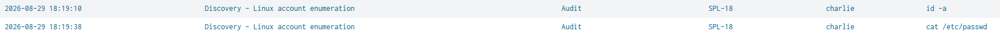

_Figure-08: Discovery alerts_

### 3.2. Discovery activity

We pivot to auditd normalized logs using the pivot fields user (charlie) and the timestamp (18:19:10 and 18:19:38) to define the investigation window. For more readable results, we exclude all logger related logs. The SPL request used is the following:
```
index="linux_os" sourcetype="linux_audit_normalized" user="charlie" | where NOT like(command_line, "%logger -p local1.notice%")
| table _time command_line executable process_id parent_process_id
```

The results show a succession of commands aiming to gather information about the current session such as the hostname, the current user, other users, the available files and directories. This is compatible with a local account discovery.

| _time	| command_line |	process_id |	parent_process_id
| - | - | - | - 
|2026-08-29 18:19:38|	cat /etc/passwd|	4389|	4351
|2026-08-29 18:19:31|	whoami|	4386|	4351
|2026-08-29 18:19:30|	file RH-archive|	4384|	4351
|2026-08-29 18:19:21|	whoami|	4378|	4351
|2026-08-29 18:19:19|	whoami|	4374|	4351
|2026-08-29 18:19:19|	ls --color=auto -la|	4372|	4351
|2026-08-29 18:19:13|	whoami|	4369|	4351
|2026-08-29 18:19:13|	hostname|	4367|	4351
|2026-08-29 18:19:10|	whoami|	4364|	4351
|2026-08-29 18:19:10|	id -a	|4362|	4351


### 3.3. Process tree

The commands are executed with the same parent process ID. In order to determine what is the parent process associated with these commands, we can pivot using the parent_process_id (4351) in order to rebuild the process tree. The process tree is primarily reconstructed using the process_id and parent_process_id fields from the normalized auditd events. When a process relationship is missing or inconsistent in the normalized data, the raw auditd events are used to validate and complete the process tree reconstruction.

_time	 | process_id | 	parent_process_id |	executable
|-|-|-|-
|2026-08-29 18:19:00	|4351 |	4350	|/usr/bin/bash	
|2026-08-29 18:19:00	| 4350|	- 	|/usr/sbin/sshd

The parent event concerns an SSH session, initiated from the IP address 10.10.10.1, with the effective user charlie, at 18:19:00. The session id (ses=7) provides another pivot field, that can be used to further investigate the activity of this session. The commands executed within this session are consistent with the activity subsequent to the second opened session observed in the previous section, which remained open from 18:19:00 for approximately 30 minutes.


### 3.4. Conclusion

Both SPL-18 alerts are confirmed as true positives. The observed commands are compatible with host and account discovery. The commands share the parent process ID 4351. The process tree was reconstructed up to PID 4350, identified as /usr/sbin/sshd in the raw auditd logs. The associated audit session (ses=7), account (charlie), SSH terminal, and source IP (10.10.10.1) correlate this activity with the SSH session established at 18:19:00. This provides a strong correlation with the successful SSH access identified during the Initial Access phase.

## 4.0. Privilege escalation

### 4.1. Detection

Privilege escalation alerts are detected based on auditd logs. The SPL-13 rule is triggered when the command line contains activity related to the addition of setuid/setgid bit on a binary with chmod, or the search for existing SUID binaries. The SPL-09 is triggered by command lines containing specific strings such as `/etc/crontab`. The investigation below allows us to include this alert in the privilege escalation phase.


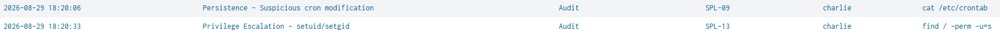

_Figure-09: Privilege escalation alerts_


### 4.2. Discovery of privilege escalation possibilities

In order to observe the activity before and after the alerts, we pivot to auditd logs using the fields username (charlie) and timestamp (18:20:06 and 18:20:33) as pivot fields. For more readable results, we exclude all logger related logs and the automatically run `whoami` from the results. The SPL request used is the following:
```
index="linux_os" sourcetype="linux_audit_normalized" user="charlie"
| where NOT like(command_line, "%logger -p local1.notice%")
| where NOT like(command_line, "whoami") 
|  table _time command_line user euid executable process_id parent_process_id
```

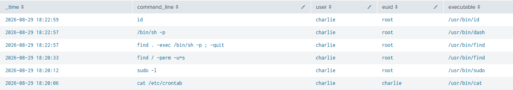

_Figure-10: Privilege escalation related commands and processes_

The results show multiple commands that are frequently used to discover ways to escalate privileges: 
- `sudo -l` to discover sudoers rights
- `cat /etc/crontab` to view any possible jobs that could be taken advantage of 
- `find / -perm -u=s` to find binaries with the suid bit set

Immediately following the third discovery command, the user executed `find . -exec /bin/sh -p ; -quit` which according to GTFOBins is the exploit used to abuse the suid bit set on the binary `/usr/bin/find`. 
The SUID-enabled /usr/bin/find binary is executed with an effective UID of 0. The `-exec` action then launches `/bin/sh -p` which preserves the elevated privileges and results in a root shell.


### 4.3. Successful privilege escalation

In order to validate the success of the privilege escalation, we rebuild the process tree.

|_time	| command_line	| auid	| euid |	process_id	| parent_process_id
| - | - | - | - | - | - |
|2026-08-29 18:22:59	|id	|charlie	|root	|4417	|4416
|2026-08-29 18:22:57	|/bin/sh -p	|charlie	|root	|4416	|4415
|2026-08-29 18:22:57	|find . -exec /bin/sh -p ; -quit	|charlie	|root	|4415	|4351

 As established previously, the PID 4351 corresponds to the child process of the sshd session. The exploit command `find . -exec /bin/sh -p ; -quit` is run with a PID 4415 and parent PID 4351. The PID 4415 is the parent process of the PID 4416 which corresponds to the start of a shell run as root. The command `id`, a child process of the elevated shell PID 4416, is commonly used to verify the current user's privileges.
 This provides strong evidence that the user charlie run a command abusing an SUID-enabled binary, and obtained a root shell.

The effective user UID indicates that the executables `/usr/bin/sudo`, `/usr/bin/find`, `/usr/bin/dash` and `/usr/bin/id` are run as root. 
This is consistent with both binaries `/usr/bin/sudo` and `/usr/bin/find` having an SUID bit enabled which sets the EUID 0. `/bin/sh -p` resolves to `/usr/bin/dash` on the analyzed system, and does not drop the privileges acquired by `/usr/bin/find`, which allows `/usr/bin/dash` to run with the EUID 0. Finally, `/usr/bin/id` is a child process of the new elevated shell, consequently run with EUID 0.

### 4.4. Conclusion

Both SPL-13 and SPL-09 alerts are confirmed as true positives. The observed commands match with privilege escalation discovery activity.
The process tree was reconstructed and processes correlated to effective users. The observed results indicate that the SUID-enabled `/usr/bin/find` binary was abused in order to obtain a shell with root privileges. The process tree also provides a strong correlation between this successful privilege escalation and the previously identified discovery activity based on the common parent process ID 4351 and the time window. 


## 5.0. Persistence

### 5.1. Detection

Persistence alerts are based on auditd logs. The SPL-09 alert is triggered by command lines containing specific strings such as `/etc/crontab`. This alert was also observed during the privilege-escalation discovery phase, and is now relevant to the persistence phase. The SPL-30 alert is triggered when the auditd field key contains the string "cron_change". This key is associated with the audit rule created on the endpoint, which watches any change made to the /etc/crontab file.

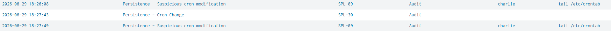

_Figure-11: Persistence alerts_

### 5.2. Scheduled job with cron

The pivot fields used are the user (charlie), the timestamp to select the time window (18:26:08 to 18:27:49), and the parent process ID (4416, 4351) corresponding to the previously identified shells, respectively the elevated shell and the shell initiated within the SSH session (ses=7). The SPL request to view logs from the normalized auditd data source is the following:
```
index="linux_os" sourcetype="linux_audit_normalized" user="charlie"
| where parent_process_id IN ("4416", "4351")
| table _time command_line euid auid executable process_id parent_process_id
```

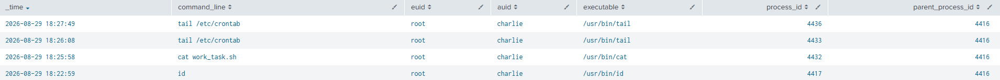

_Figure-12: Observed activity_

The results show the observable activity within the elevated shell: the user viewed a file named `work_task.sh`, and the end of `/etc/crontab`.
However the observed activity does not provide evidence of the `/etc/crontab` file modification.
Therefore we pivot to raw auditd logs using the key field (cron_change): an event corresponding to this key is observed at 18:27:43, with the PID 4416 indicating that the modification was done from the elevated shell.

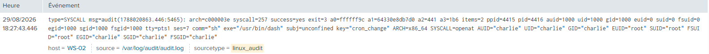

_Figure-13: Audit Cron change_

In order to verify the change that occurred, we need to investigate the endpoint (host WS-02).
The content of the `/etc/crontab` indicates a new line was added, scheduled to run the script `/home/charlie/work_task.sh` at system reboot, with root privileges. 

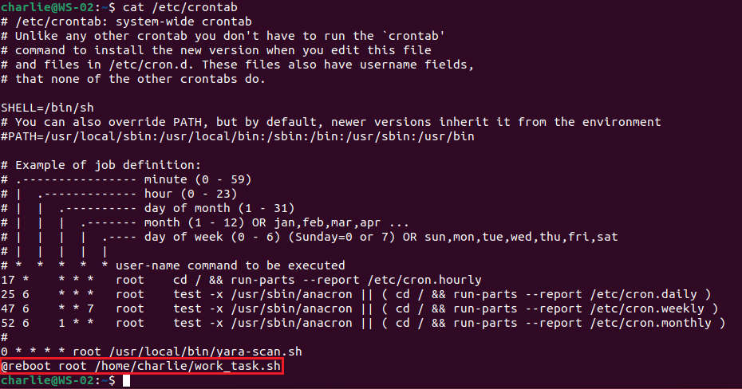

_Figure-14: /etc/crontab content_

The content of the shell script indicates a TCP reverse shell connecting to 10.10.10.1, on port 4444. This IP address is identical to the source IP address that initiated the discovery scans and the SSH session identified previously.

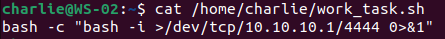

_Figure-15: work_task.sh content_

### 5.3. YARA Detection

The file `work_task.sh` was scanned by YARA at 19:00:22 resulting in the following SPL-26 alert, based on the specific strings contained in the file:

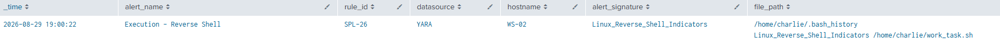

_Figure-16: YARA alert_

Although the content of the file is not seen in the SIEM, the malicious content was still detected by YARA. The alert was triggered later than the actual activity due to the frequency of the scan, which runs only once an hour.

### 5.4. SSH authorized connection

The following activity is observable by extending the time window while using the same pivot fields as earlier. The results indicate that the user charlie created SSH keys within the elevated shell.

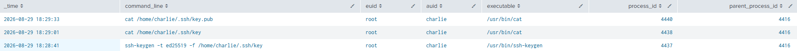

_Figure-17: SSH keys Activity_

The authorized_keys file was modified at 18:29, suggesting that the user created the keys and added the public key to the authorized_keys file. The modification of this file is currently not monitored by auditd.


_Figure-18: authorized_keys file_

We can correlate this event with the SSH session initiated at 18:30:13. This session was established using a publickey connection, for the user charlie, from the IP source address 10.10.10.1. Pivoting to audit logs based on the PID (4444), we identify the session was opened with the EUID 0, and was closed four seconds later (ses=4294967295).

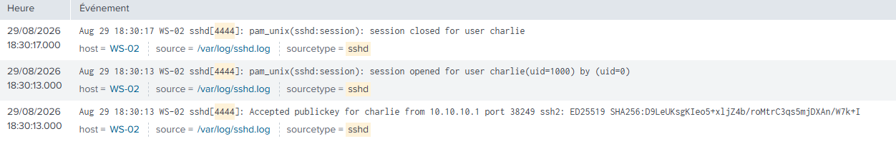

_Figure-19: SSH session_

This activity is compatible with the creation and testing of a persistent SSH key-based access.

### 5.5. Conclusion

Both SPL-09 and SPL-30 alerts are confirmed as true positives. The cron activity is consistent with the creation of a scheduled backdoor run at reboot, reaching towards the IP address 10.10.10.1. YARA detected the content of the shell script containing the backdoor as malicious, with a slight delay due to the frequency of the YARA scan. The SPL-26 alert is also confirmed as a true positive.
Another suspicious activity is identified concerning the creation of a new key-based SSH access followed by a brief SSH session originated from the IP address 10.10.10.1, which is compatible with the establishment of a second persistence mechanism. The activity was observable in the telemetry available but was not detected by the SIEM detection logic, since the SSH connection related alerts are based on the successful/failure password-based authentication.


## 6.0. Data Collection & Exfiltration

### 6.1. Detection

Two alerts are raised. The first one at 18:31:21 based on auditd logs (SPL-18) is triggered when the command line contains specific strings such as "/etc/shadow". The second one at 18:35:53 based on zeek log (SPL-25) is triggered when a large amount of data is sent over the port 443 for at least a certain amount of time. 

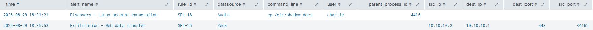

_Figure-20: Data collection and exfiltration related alerts_

### 6.2. Data collection

We observe the activity within a time window around 18:31:21, using the pivot fields user (charlie), and the parent process ID (4416). The result indicates that the user created a `docs` folder and copied both files `/etc/shadow` and `RH-archive` into the newly created `docs` folder. The parent process ID provides strong evidence that  the activity occurred from the elevated shell identified previously.

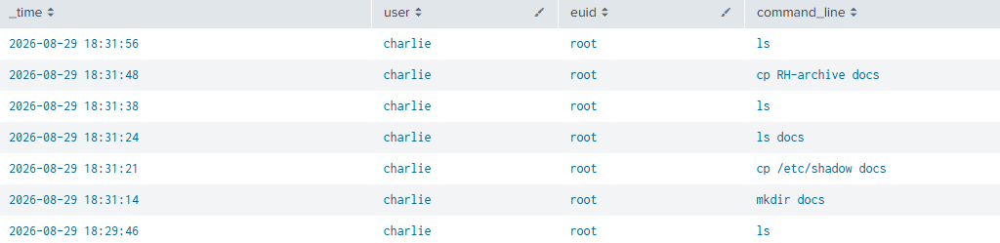

_Figure-21: Data collection_


### 6.3. Data exfiltration

Slightly extending the time window shows that the user attempted to send the collected files towards the destination IP address 10.10.10.1 on port 443.

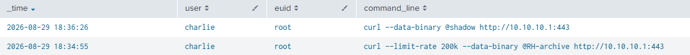

_Figure-22: Data transfer with curl_

In order to verify the traffic that occurred, we pivot to Zeek logs based on the fields provided in the previous analysis and the alert raised: source IP address (10.10.10.2), destination IP address (10.10.10.1), source port (34162), destination port (443), and the time window (around 18:35:53). The SPL request used is the following:
```
index="monitoring" sourcetype="zeek_conn" src_ip="10.10.10.2" dest_ip="10.10.10.1" dest_port="443" src_port="34162"
```

One corresponding Zeek connection event is found, showing a TCP connection that lasted over 51 seconds and transferred approximately 10 megabytes. The timestamp matches the first exfiltration command line observed previously, concerning the RH-archive file. However there is no second event, which might indicate that the second transfer attempt failed or that both transfers occurred on the same TCP connection. 

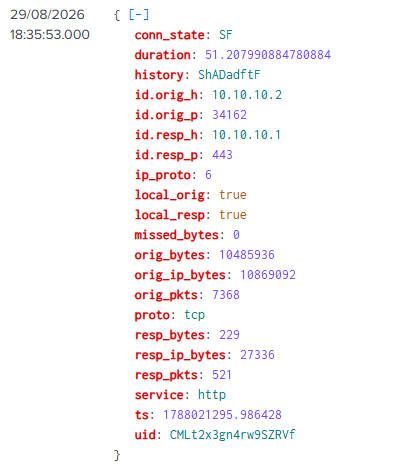

_Figure-23: Zeek event_

In order to verify the traffic that actually happened, we investigate the tcpdump packet-level capture. We use the pivot field source IP address and destination IP address. We observe a large quantity of TCP packets reaching 10.10.10.1 on port 443. Following the HTTP flow, we observe that the `/etc/shadow` file was successfully sent to 10.10.10.1, with the curl user agent, at the time of the observed curl command lines.

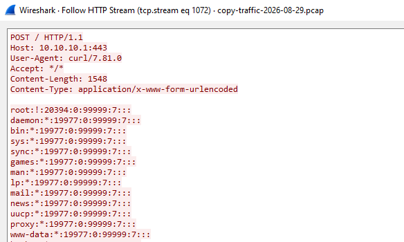

_Figure-24: /etc/shadow exfiltration_


### 6.4. Conclusion

Both SPL-18 and SPL-25 alerts are confirmed as true positives. The observed activity is consistent with the collection of sensitive files (`RH-archive` and `/etc/shadow`), followed by their exfiltration to 10.10.10.1. The parent process ID (4416) provides strong evidence that the activity originated from the same elevated shell identified previously. Zeek logs confirm the corresponding network connection and the transfer of approximately 10 MB of data. Packet-level investigation confirmed that the data was successfully transferred to 10.10.10.1 through HTTP traffic, using the user agent curl.

### 7.0 Post-Compromise Activity

Post-Compromise activity can be observed in the auditd logs by extending the time window. The user performed `vim .bash_history` in order to remove traces of previously executed commands from the shell history. This can be confirmed directly on the endpoint, by viewing the bash history: none of the command lines observed during the investigation appear in the local history.

This indicates that the post compromission activity was not detected in the SIEM. However the activity remains observable in the SIEM and in specific log files on the endpoint.