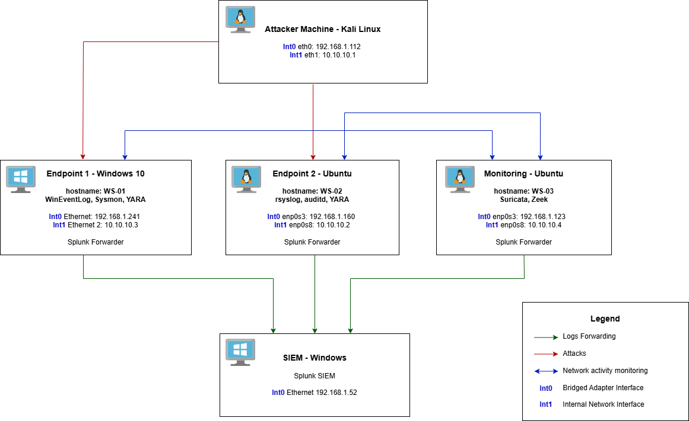
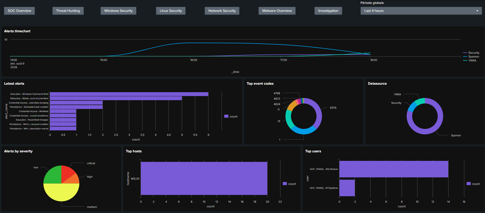

# SOC Lab: Detection Engineering & Incident Investigation

This project is a hands-on SOC lab designed to demonstrate detection engineering, security monitoring, incident investigation and incident response across Windows and Linux environments. It covers the complete workflow from log collection and normalization to Sigma-based detection, Splunk alerting, attack simulation, investigation and executive reporting.

## Architecture

The lab is made of two endpoints (Windows and Ubuntu), a monitoring machine (Ubuntu).
The attacker machine is a Kali Linux machine.
The SIEM is setup with Splunk, hosted on a Windows machine.

The architecture in place is represented in the diagram below:

## Detection Engineering

The detection workflow is:

1. Log Collection: collect logs on each endpoint and forward them to the SIEM
2. Field Normalization: map the logs original fields to common fields shared between all data sources
3. Sigma Rules: detection rules for windows, linux and network activity, based on normalized fields
4. Splunk Alerts: create splunk searches based on Sigma rules, using a custom automation python script
5. Dashboards: create Splunk dashboards to display important information, including the main KPIs, timecharts, enrichment with MITRE ATT&CK Tactics and Techniques.

Here is a dashboard example for Windows Security:

## Attack Scenarios

- Linux complete scenario
- Windows complete scenario
- Phishing for credentials
- C2 Beacon
- False positives

## Incident Response

- Investigation
- Timeline
- IOC
- Recommandation
- Executive report (pdf)

Results of alerts raised by attack scenario

## Technical Stack

Technical Stack
- Ubuntu logs: syslog, rsyslog, auditd
- Windows logs: Windows Event Log, Sysmon
- Network monitoring: Suricata, Zeek, tcpdump
- Malware monitoring: YARA (on both Windows and Ubuntu endpoints)
- Log forwarding: Splunk Universal Forwarder
- SIEM: Splunk (free version) dashboards and alerts
- Attacks generated from Kali using nmap, hydra, python3, smbclient, netcat
- Automation of splunk reports creation and update: python3
- Investigation: Wireshark, Splunk

## Index

- [01-architecture](./01-architecture/)
- [02-detection-engineering](./02-detection-engineering/)
    - [01-collection](./02-detection-engineering/01-collection/)
    - [02-normalization](./02-detection-engineering/02-normalization/)
    - [03-sigma-rules](./02-detection-engineering/03-sigma-rules/)
    - [04-splunk-alerts](./02-detection-engineering/04-splunk-alerts/)
    - [05-dashboards](./02-detection-engineering/05-dashboards/)
- [03-incident-investigation](./03-incident-investigation/)

## Lessons Learned

Encontered problems and what I learned from them:
- Ubuntu monitoring VM crashed, not enough space to handle the logs. I re created the machine efficiently using the documentation from this repository. This also led to adjusting the allowed size of the other VMs, and making clones of each VM.
- Windows endpoint: the initial configuration of yara was that yara was triggered any time a file is created, but the logs were added to a new file, and yara kept triggering on the newly created log file. This used so much resources that it crashed both the windows endpoint in the VM and the host computer. when rebooting the host, I completely recreated the Windows endpoint, using the documentation, and switched from the execution of yara from triggering events to a scheduled task.
- creating sigma and splunk alerts takes up a lot of time. In order to speed things up, I wrote an automation script adapted to the sigma rules of the lab, to create splunk alerts faster. This reduces the risk of error and increases the efficiency.
- throughout the setup, testing is really important. I encountered many configuration problems that if not fixed during testing, could have led to failure to detect malicious activity.
- Splunk Free does not allow creation of planned alert: need to create reports and run them manually. In order to avoid having to run one report for each splunk alert, I created another script to concatenate all alerts by platform, to be able to run all splunk alerts and collect them at once.
- auditd encodes in hexadecimal the command line arguments if it contains special characters: I realized it while testing the alerts. Two points are learned from this: testing is paramount, and a macro was added to parse the command line properly.
- logrotates recreates the files with the wrong rights, so the user syslog was not allowed to write the bash, sudo and sshd logs in the corresponding log files. The solution is to attribute the correct rights to the file and modify the logortate scripts so that it creates the files correctly for the next rotation.
- the windows endpoint has limitations. Since the version that I chose does not allow RDP connection, a future improvement can be to set up a Windows Server to monitor RDP Connections.
