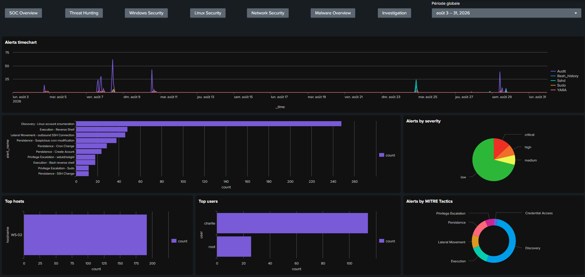

# SOC Lab: Detection Engineering & Incident Investigation

This project is a **hands-on SOC lab** designed to reproduce an end-to-end security monitoring, detection engineering and incident response workflow across Windows and Linux environments. The lab covers the **complete workflow from telemetry collection and normalization to Sigma-based detection, Splunk alerting, attack simulation, investigation and security reporting**. The goal is not only to demonstrate how an attack can be detected, but also to reproduce the workflow an analyst would follow to **collect and validate telemetry, investigate suspicious activity, reconstruct an incident timeline, perform response actions and report the findings**.

## What this project demonstrates

- **Security monitoring**: Auditd, Syslog, Windows Event Logs, Sysmon, Suricata, Zeek, YARA
- **Detection engineering**: field normalization, Sigma rules, MITRE ATT&CK mapping
- **SIEM**: logs ingestion, Splunk alerts and dashboards, SPL searches
- **Incident investigation**: event correlation, timeline reconstruction, evidence analysis, network analysis
- **Automation**: Python tooling to generate and maintain Splunk alerts based on Sigma detection rules
- **Security reporting**: technical investigation report, executive report

### Current status
- **Completed:** 
    - Detection engineering pipeline, SIEM dashboards
    - Linux attack simulation, investigation, response and reporting
- **In progress**: Windows attack simulation and investigation
- **Planned:** phishing and C2 beacon scenario simulation and investigation, false-positive analysis

### Project metrics

| Component | Metric
|-|-
| Detection rules | 32 Sigma rules
| Splunk alerts | 32 alerts, split into 3 categories: Linux, Windows, Network
| Detection testing | 25 Splunk alerts tested before the attack simulation
| MITRE ATT&CK mapping | 26 techniques across 9 tactics
| Splunk dashboards | 7 dashboards (Overview, Threat Hunting, Linux, Windows, Network, Malware, Investigation)
| Linux incident investigation | 17 alerts investigated across the attack chain

## Architecture

- Windows endpoint: Windows Event Logs, Sysmon, YARA
- Ubuntu endpoint: Syslog, Auditd, YARA
- Ubuntu Network monitoring: Ubuntu machine with Suricata, Zeek and tcpdump
- Attacker machine: Kali Linux
- SIEM: Splunk, hosted on a dedicated Windows machine

The architecture in place is represented in the diagram below:

## Detection Engineering

The detection workflow is:

1. **Log Collection**: collect logs on each endpoint and forward them to the SIEM
2. **Field Normalization**: map the original log fields to common fields shared between all data sources, allowing detections to remain independent of the original log format
3. **Sigma Rules**: detection rules for Windows, Linux and Network activity, based on normalized fields, mapped to selected MITRE ATT&CK Techniques
4. **Splunk Alerts**: create Splunk searches based on Sigma rules, using a custom Python automation script
5. **Dashboards**: create Splunk dashboards to display important information, including the main KPIs, timecharts, enrichment with MITRE ATT&CK Tactics and Techniques.

Here is a dashboard example for Linux Security:

## Attack Scenarios & Incident Response

### Completed
- Complete Linux attack scenario, including:
    - Reconnaissance: Host and port scanning
    - Initial access: FTP Service interaction followed by SSH brute force and credential access
    - Discovery: Local account enumeration
    - Privilege escalation through SUID binary abuse
    - Persistence with cron job and SSH key-based access
    - Data collection and exfiltration over HTTP

Key findings, detailed investigation, timeline and executive reports are available in this repository:
- the incident overview and the **incident timeline** are available [here](./03-incident-investigation/investigations/01-linux-compromission/README.md)
- the **detailed investigation**, queries, evidence, conclusion is available [here](./03-incident-investigation/investigations/01-linux-compromission/investigation.md)
- the **incident response** actions taken to contain, eradicate and recover from the incident are available [here](./03-incident-investigation/investigations/01-linux-compromission/incident-response.md)
- the **executive report** including the environment monitored, key findings, recommendations is available [here](./03-incident-investigation/executive-reports/01-linux-executive-report.pdf)

### In progress
- Complete Windows attack scenario, including:
    - Host and port scanning
    - SMB service interaction
    - Initial access
    - Local account discovery
    - Privilege escalation through unquoted service path
    - Persistence with a scheduled task
    - Data collection and exfiltration over HTTP

### Planned
- Phishing: a user clicks on the link in a phishing email and logs in on a fake website, the cleartext credentials are stolen
- C2 Beacon: develop a custom python C2 server and beacon to generate beaconing activity, detect persistence and periodic outbound communication
- False positives: simulate legitimate activity such as HR onboarding, creating ssh key-based access and backup cron job, sending a backup file to a distant server, security audit and inventory

## Technical Stack

- Ubuntu logs: syslog, rsyslog, auditd
- Windows logs: Windows Event Log, Sysmon
- Network monitoring: Suricata, Zeek, tcpdump
- File based malware monitoring: YARA (on both Windows and Ubuntu endpoints)
- Log forwarding: Splunk Universal Forwarder
- SIEM: Splunk dashboards and alerts
- Attacks generated from Kali Linux using nmap, hydra, python, smbclient
- Automation: Python scripts for Splunk report creation and update
- Investigation: Wireshark, Splunk

## Index

- [01-architecture](./01-architecture/)
- [02-detection-engineering](./02-detection-engineering/)
    - [01-collection](./02-detection-engineering/01-collection/)
    - [02-normalization](./02-detection-engineering/02-normalization/)
    - [03-sigma-rules](./02-detection-engineering/03-sigma-rules/)
    - [04-splunk-alerts](./02-detection-engineering/04-splunk-alerts/)
    - [05-dashboards](./02-detection-engineering/05-dashboards/)
- [03-incident-investigation](./03-incident-investigation/)
    - [linux-investigation](./03-incident-investigation/investigations/01-linux-compromission/)
    - [executive-reports](./03-incident-investigation/executive-reports/)

## Lessons Learned

### Resource management

- The Ubuntu monitoring VM crashed, due to not enough space to handle the logs. I recreated the machine efficiently using the documentation from this repository. This also led to adjusting the allowed size of the other VMs, and making clones of each VM.

### Detection pipeline testing

- YARA was initially triggered any time a file was created. But since the monitoring process creates a new log file, YARA kept triggering its own output. This consumed so much resources that it crashed both the Windows VM and the host. When rebooting the host, I completely recreated the Windows endpoint, using the documentation, and replaced the event-based execution with YARA scheduled scans.
- Auditd encodes the command line arguments in hexadecimal if it contains special characters, the arguments are split in different fields and one event is split into different event types (SYSCALL, EXECVE, CWD) which makes the detection harder based on the raw events. In order to facilitate the detection, the auditd are parsed into a normalized datasource, regrouped by event Id and normalized, with reconstructed command lines, path, effective user, process IDs and parent process IDs.
- Logrotate recreates the files with the wrong rights, which means that after the first rotation, the user syslog was not allowed to write the bash history, sudo and sshd logs in the corresponding custom log files. The solution is to attribute the correct rights to the file and modify the logrotate scripts so that it creates the files correctly for the next rotation.
- Throughout the setup, testing is really important. I encountered many configuration problems that if not fixed during testing, could have led to failure to detect malicious activity.

### Automation
- Creating Sigma and Splunk alerts takes up a lot of time. In order to speed things up, I wrote an automation script adapted to the Sigma rules of the lab, to create Splunk detection searches faster. This reduces the risk of error and increases the efficiency.

### Limitations

- Splunk Free does not support scheduled alerts. Therefore, the SPL detection searches are stored as reports and executed manually. In order to avoid running one report for each Splunk alert, I developed another Python script to concatenate all alerts by platform, to be able to run all Splunk alerts and collect them at once.
- The Windows endpoint has limitations. Since the version that I chose does not allow RDP connection, a future improvement can be to set up a Windows Server to monitor RDP Connections.
- The lab consists of a limited number of endpoints, accounts, and traffic. It does not reproduce the volume and operational activity of a real-worl enterprise SOC environment.
